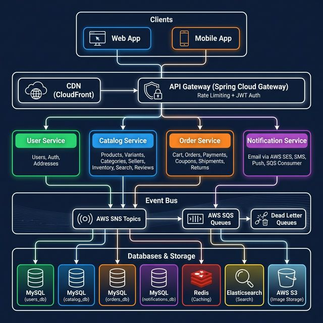
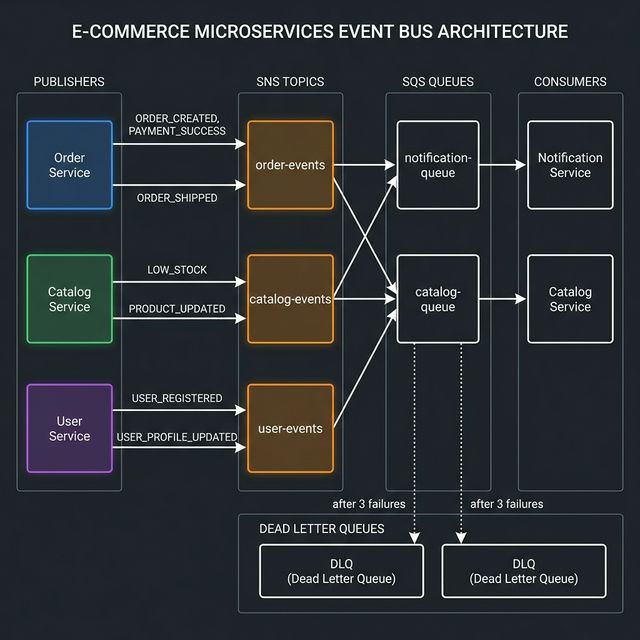
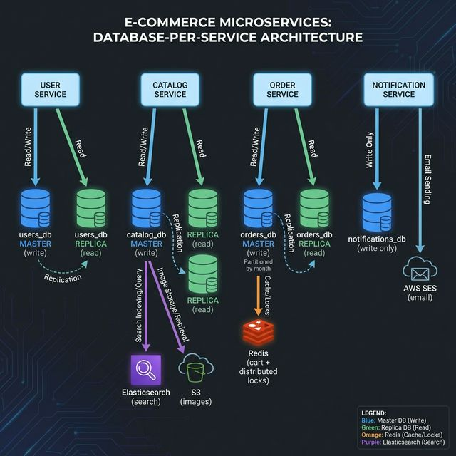
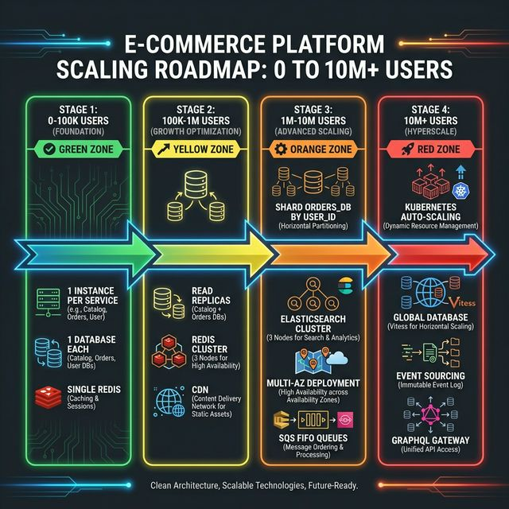

# 🛒 E-Commerce Platform — Production Microservices

> A production-grade microservices e-commerce platform built with **Spring Boot 3.4**, **MySQL** (database-per-service), **AWS SNS/SQS/DLQ**, **AWS SES**, **Redis**, and **Docker**. Designed to handle **millions of concurrent users** with independent per-service scaling.

---

## 📐 Production Architecture



---

## � Event-Driven Architecture — SNS → SQS → DLQ



**How it works:**
- **Publishers** (Order, Catalog, User services) push events to **SNS Topics**
- SNS fans out to **SQS Queues** (one per consumer)
- **Consumers** (Notification Service, Catalog Service) poll their queues
- After **3 failed retries** → message moves to **Dead Letter Queue** → CloudWatch alarm fires

| Event | Published By | Consumed By |
|-------|-------------|-------------|
| `ORDER_CREATED` | Order Service | Notification Service |
| `ORDER_SHIPPED` | Order Service | Notification Service |
| `ORDER_DELIVERED` | Order Service | Notification Service |
| `ORDER_CANCELLED` | Order Service | Notification Service |
| `PAYMENT_SUCCESS` | Order Service | Notification Service |
| `PAYMENT_FAILED` | Order Service | Notification Service |
| `USER_REGISTERED` | User Service | Notification Service |
| `LOW_STOCK_ALERT` | Catalog Service | Ops Team (via email) |

---

## 🔄 Order Flow — End-to-End Sequence


**14-step flow:**
1. User sends `POST /api/orders` with JWT token
2. API Gateway validates JWT + applies rate limit (100 req/min/user)
3. Request forwarded to Order Service
4. Order Service calls Catalog Service to check prices & stock
5. Catalog Service confirms availability
6. Order Service requests inventory reservation
7. Catalog Service acquires **Redis distributed lock** to prevent overselling
8. Stock reserved ✅
9. Order Service saves order + payment in a DB transaction
10. Publishes `ORDER_CREATED` event to SNS
11. SNS delivers to SQS notification queue
12. Notification Service consumes the event
13. Sends order confirmation email via **AWS SES** ✉️
14. Logs notification to `notification_logs` table

---

## � Database-Per-Service Architecture



### 18 Tables Across 4 Databases

| Database | Port | Tables | Count |
|----------|------|--------|-------|
| `users_db` | 3306 | users, addresses | 2 |
| `catalog_db` | 3307 | sellers, categories, products, product_variants, product_images, inventory, reviews, wishlists | 8 |
| `orders_db` | 3308 | coupons, orders, order_items, order_status_history, payments, shipments, returns_refunds | 7 |
| `notifications_db` | 3309 | notification_logs | 1 |

### Read/Write Split Strategy
- **Writes** → Master database (single source of truth)
- **Reads** → Replicas (horizontal scaling for heavy traffic)
- **Catalog** gets 2 replicas (highest read traffic — browsing)
- **Orders** table partitioned by month (fast queries on historical data)

---

## 🚀 Scaling Roadmap — 0 to 10M+ Users



### How We Handle Traffic at Each Stage

| Stage | Users | Key Changes |
|-------|-------|------------|
| **Stage 1** (Foundation) | 0–100K | 1 instance per service, 1 DB each, single Redis |
| **Stage 2** (Growth) | 100K–1M | Read replicas, Redis Cluster (3 nodes), CDN |
| **Stage 3** (Advanced) | 1M–10M | Shard orders_db by user_id, Elasticsearch cluster, Multi-AZ |
| **Stage 4** (Hyperscale) | 10M+ | Kubernetes auto-scaling, Vitess global DB, Event sourcing |

---

## 🏗️ Service Architecture & Features

### Service 1: User Service (`:8081`)

| Feature | Description |
|---------|-------------|
| **Database** | `users_db` — 2 tables (`users`, `addresses`) |
| **Auth** | JWT-based authentication, BCrypt password hashing |
| **Roles** | CUSTOMER, SELLER, ADMIN with ENUM-based role management |
| **Address** | Multiple addresses per user, default address auto-switching |
| **Events** | Publishes `USER_REGISTERED` → triggers welcome email |

```
POST   /api/users                    ← Register
GET    /api/users/{id}               ← Get profile
PUT    /api/users/{id}               ← Update profile
POST   /api/users/{id}/addresses     ← Add address
GET    /api/users/{id}/addresses     ← List addresses
```

---

### Service 2: Catalog Service (`:8082`)

| Feature | Description |
|---------|-------------|
| **Database** | `catalog_db` — 8 tables |
| **Products** | FULLTEXT search, optimistic locking (`@Version`) |
| **Inventory** | **Redis distributed lock** prevents overselling during flash sales |
| **Categories** | Self-referencing hierarchy (Electronics → Phones → Samsung) |
| **Reviews** | Unique per user-product, moderation workflow |

**🔒 How Distributed Locks Prevent Overselling:**

```
Concurrent Request A ─┐                     
                      ├→ Redis SETNX "lock:inventory:variant123" → ✅ Acquired
Concurrent Request B ─┘                                            ❌ Blocked
                      
Request A: Check stock (50) → Reserve 2 → Save (48) → Release lock
Request B: Retries → Acquires lock → Check stock (48) → Reserve 3 → Save (45)
```

```
POST   /api/products                  ← Create product
GET    /api/products/{id}             ← Get by ID
GET    /api/products/search?q=...     ← FULLTEXT search
POST   /internal/inventory/reserve    ← Reserve stock (internal)
POST   /internal/inventory/release    ← Release stock (internal)
```

---

### Service 3: Order Service (`:8083`)

| Feature | Description |
|---------|-------------|
| **Database** | `orders_db` — 7 tables (orders partitioned by month) |
| **Cart** | **Redis-backed** (24h TTL) — no MySQL table, O(1) lookups |
| **Orders** | Idempotent creation via `idempotency_key` |
| **Payments** | UPI, Card, Net Banking, COD, Wallet |
| **Address Snapshot** | JSON at order time (immune to future edits) |
| **Timeline** | Full status history: Pending → Confirmed → Shipped → Delivered |
| **Returns** | Return, Refund, Exchange with approval workflow |
| **Coupons** | Percentage/Fixed, usage limits, validity dates |

**💡 Idempotency — No Duplicate Orders:**

```
User clicks "Place Order" twice (slow network):
  
Request 1: idempotency_key = "abc-123" → Creates order ✅
Request 2: idempotency_key = "abc-123" → Returns same order ✅ (no duplicate!)
```

```
POST   /api/orders                       ← Place order
GET    /api/orders/{id}                  ← Get order
PATCH  /api/orders/{id}/status           ← Update status
GET    /api/orders/{id}/timeline         ← Status history
POST   /api/cart/{userId}                ← Add to cart
GET    /api/cart/{userId}                ← View cart
DELETE /api/cart/{userId}                ← Clear cart
```

---

### Service 4: Notification Service (`:8084`)

| Feature | Description |
|---------|-------------|
| **Database** | `notifications_db` — 1 table (`notification_logs`) |
| **SQS Consumer** | Listens to `notification-queue` subscribed to all SNS topics |
| **AWS SES** | Sends HTML transactional emails |
| **Idempotency** | Skips duplicate events via `idempotency_key` |
| **DLQ** | After 3 retries → `notification-dlq` |

**📧 Email Triggers:**

| Event | Email Subject | Recipient |
|-------|--------------|-----------|
| `ORDER_CREATED` | "Order Placed — ORD-123456" | Customer |
| `ORDER_SHIPPED` | "Order Shipped 🚚" | Customer |
| `ORDER_DELIVERED` | "Delivered 📦" | Customer |
| `ORDER_CANCELLED` | "Order Cancelled" | Customer |
| `PAYMENT_SUCCESS` | "Payment Received ✅" | Customer |
| `PAYMENT_FAILED` | "Payment Failed ❌" | Customer |
| `USER_REGISTERED` | "Welcome! 🎉" | New User |
| `LOW_STOCK_ALERT` | "⚠️ Low Stock Alert" | Ops Team |

---

## � Handling Millions of Users

### Traffic Bottlenecks & Solutions

| Scenario | Bottleneck | Solution |
|----------|-----------|----------|
| **Flash sale** (100K concurrent) | Inventory overwrites | Redis distributed locks + optimistic locking |
| **Product browsing** (1M/hr) | DB read load | Read replicas + Redis cache (15min TTL) + CDN |
| **Search queries** (500K/hr) | MySQL LIKE queries | Elasticsearch (sub-100ms results) |
| **Order placement** (50K/hr) | DB write throughput | Order table partitioned by month |
| **Cart operations** (2M/hr) | DB connection exhaustion | Redis-backed cart (no MySQL) |
| **Email sending** (100K/hr) | Synchronous processing | Async via SQS → SES (non-blocking) |
| **API abuse** | DDoS / bot attacks | WAF + API Gateway rate limiting (100 req/min) |
| **Payment gateway down** | Cascading failures | Circuit breaker (Resilience4j) — fail fast |

### Caching Strategy

| Data | Where | TTL | Invalidation |
|------|-------|-----|-------------|
| Product details | Caffeine (L1) + Redis (L2) | 15 min | On product update |
| Category tree | Caffeine + Redis | 1 hr | On admin change |
| Cart items | Redis | 24 hr | On cart edit |
| User session/JWT | Redis | 30 min | On logout |
| Inventory count | Redis | 30 sec | On order/restock |
| Search results | Redis | 5 min | Time-based |

---

## 🛡️ Production Safeguards

| Safeguard | Where | Purpose |
|-----------|-------|---------|
| **Idempotency Keys** | Orders + Payments | Prevents duplicate orders on retry |
| **Distributed Locks** | Inventory (Redis SETNX) | Prevents overselling |
| **Optimistic Locking** | Products + Inventory (`@Version`) | Detects concurrent writes |
| **Circuit Breaker** | Payment Gateway calls | Fails fast when Razorpay is down |
| **Dead Letter Queues** | SQS → DLQ after 3 retries | Preserves failed messages |
| **Address Snapshots** | Orders (JSON column) | Historical address accuracy |
| **Rate Limiting** | API Gateway | 100 req/min/user |
| **WAF** | CloudFront | Blocks SQL injection, XSS, DDoS |

---

## 📊 Monitoring & Observability

| Layer | Tool | What It Does |
|-------|------|-------------|
| **Metrics** | Prometheus + Grafana | QPS, error rate, latency, DB connections, cache hit rate |
| **Logs** | ELK Stack | Centralized search across all 4 services |
| **Tracing** | Zipkin | Trace requests across services, find slow service |
| **Alerting** | CloudWatch | DLQ depth > 0 → PagerDuty, Error rate > 5% → Slack |

---

## 💿 Backup Strategy

| DB | Method | Frequency | Retention |
|----|--------|-----------|-----------|
| All DBs | `mysqldump` | Daily 2 AM | 30 days |
| orders_db | `xtrabackup` | Weekly | 90 days |
| All DBs | Binlog replication | Continuous | 7 days |
| All DBs | Cloud snapshots | Every 6 hrs | 14 days |

---

## ✅ Production Checklist — 34 Components

| # | Component | Status | Where |
|---|-----------|--------|-------|
| 1 | Web App | ✅ | Frontend (separate repo) |
| 2 | Mobile App | ✅ | React Native |
| 3 | CDN (CloudFront) | ✅ | Static assets + images |
| 4 | WAF | ✅ | SQL injection, XSS, DDoS |
| 5 | SSL/TLS | ✅ | HTTPS everywhere |
| 6 | API Gateway + Rate Limiting | ✅ | Spring Cloud Gateway |
| 7 | JWT Authentication | ✅ | User Service |
| 8 | Service Discovery | ✅ | Netflix Eureka |
| 9 | Config Server | ✅ | Spring Cloud Config |
| 10 | Circuit Breaker | ✅ | Resilience4j |
| 11 | Distributed Tracing | ✅ | Zipkin |
| 12 | User Service | ✅ | Auth, Users, Addresses |
| 13 | Catalog Service | ✅ | Products, Inventory, Search |
| 14 | Order Service | ✅ | Cart, Orders, Payments |
| 15 | Notification Service | ✅ | SQS → SES email |
| 16 | AWS SNS | ✅ | 3 topics |
| 17 | AWS SQS | ✅ | 3 queues |
| 18 | Dead Letter Queues | ✅ | 3 retries → DLQ |
| 19 | MySQL (per-service) | ✅ | 4 databases |
| 20 | Read Replicas | ✅ | Master-slave per DB |
| 21 | Table Partitioning | ✅ | Orders by month |
| 22 | Redis | ✅ | Cache + Cart + Locks |
| 23 | Elasticsearch | ✅ | Product search |
| 24 | AWS S3 | ✅ | Product images |
| 25 | AWS SES | ✅ | Transactional emails |
| 26 | Payment Gateway | ✅ | Razorpay/Stripe |
| 27 | DB Backups | ✅ | Daily + weekly |
| 28 | Binlog Replication | ✅ | Continuous |
| 29 | Prometheus + Grafana | ✅ | Metrics |
| 30 | ELK Stack | ✅ | Centralized logs |
| 31 | Distributed Tracing | ✅ | Zipkin |
| 32 | Idempotency Keys | ✅ | Orders + Payments |
| 33 | Distributed Locks | ✅ | Redis for inventory |
| 34 | Optimistic Locking | ✅ | @Version on products |

---

## 🛠️ Tech Stack

| Layer | Technology |
|-------|-----------|
| Language | Java 21 |
| Framework | Spring Boot 3.4.2, Spring Cloud 2024.0.0 |
| Database | MySQL 8.0 (database-per-service) |
| Migrations | Flyway |
| Cache | Redis 7 |
| Message Bus | AWS SNS + SQS + DLQ |
| Email | AWS SES |
| Search | Elasticsearch |
| Containerization | Docker + Docker Compose |
| Local AWS | LocalStack |
| Build | Maven (multi-module) |
| Monitoring | Prometheus, Grafana, ELK, Zipkin |

---

## 📁 Project Structure

```
ecommerce-platform/
├── pom.xml                          ← Parent POM (Spring Boot 3.4.2)
├── docker-compose.yml               ← 4 MySQL + Redis + LocalStack
├── localstack-init.sh               ← Auto-creates SNS/SQS/DLQ/SES
├── docs/                            ← Architecture diagrams
│   ├── architecture.png
│   ├── event-bus.png
│   ├── order-flow.png
│   ├── database-architecture.png
│   └── scaling-roadmap.png
├── common-lib/                      ← Shared events, DTOs, exceptions
├── user-service/                    ← :8081 · users_db
├── catalog-service/                 ← :8082 · catalog_db
├── order-service/                   ← :8083 · orders_db
└── notification-service/            ← :8084 · notifications_db
```

---

## 🚀 Quick Start

### Prerequisites
- Java 21
- Docker & Docker Compose
- Maven 3.9+

### Start Infrastructure

```bash
# Start all databases + Redis + LocalStack
docker-compose up -d

# Wait for containers (~30s)
docker-compose logs -f localstack
# Look for: "✅ LocalStack initialization complete!"
```

### Build & Run

```bash
# Build all services
./mvnw clean package -DskipTests

# Start each service (separate terminals)
java -jar user-service/target/user-service-1.0.0-SNAPSHOT.jar
java -jar catalog-service/target/catalog-service-1.0.0-SNAPSHOT.jar
java -jar order-service/target/order-service-1.0.0-SNAPSHOT.jar
java -jar notification-service/target/notification-service-1.0.0-SNAPSHOT.jar
```

### Test

```bash
# Register a user
curl -X POST http://localhost:8081/api/users \
  -H "Content-Type: application/json" \
  -d '{"email":"test@test.com","password":"password123","fullName":"Test User"}'

# Redis Commander (cart visualization)
open http://localhost:8090
```

---

## 📄 License

MIT
